# riff

A scriptable HTTP(S) interception proxy with a small purpose-built rule
language and a live web UI.

Point a client at riff, write rules in `.riff`, and watch (or rewrite) the API
traffic going past.

[**Download**](https://github.com/yamazed/riff/releases/latest) ·
[**Watch the 4-minute film**](https://yamazed.github.io/riff/tutorial/riff-promo.html) ·
[**Take the walkthrough**](https://yamazed.github.io/riff/tutorial/riff-walkthrough.html)

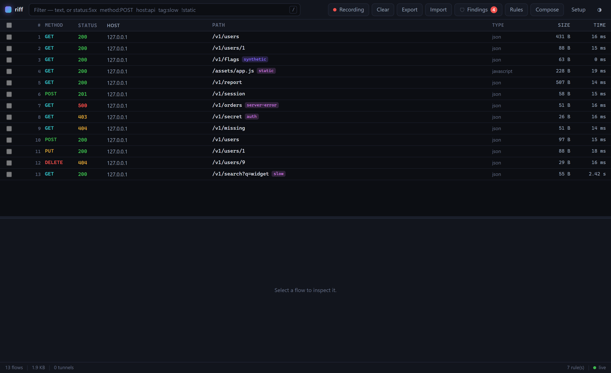

> **The name.** A riff is a short phrase a musician repeats and improvises
> around — which is what the rule scripts do to your traffic. It is not an
> acronym.

---

## Contents

- [Quick start](#quick-start)
- [The UI](#the-ui)
- [The rule language](#the-rule-language)
- [Sharing it with other people](#sharing-it-with-other-people)
- [Security](#security)
- [Command line](#command-line)
- [What it supports](#what-it-supports)
- [Development](#development)

---

## Quick start

> 🎬 **Watch instead.** The
> [interactive walkthrough](https://yamazed.github.io/riff/tutorial/riff-walkthrough.html)
> is a narrated, click-through tour of installing and using riff, in 31 steps.
> The [4-minute film](https://yamazed.github.io/riff/tutorial/riff-promo.html) is
> the short version. Both play in the browser. The steps below cover the same
> ground in text.

**Prebuilt binary:** grab `riff.exe` from the
[latest release](https://github.com/yamazed/riff/releases/latest) — no Python
needed — then run `riff.exe setup`. That one file is the whole tool: the web UI
is bundled inside it.

> **It is not code-signed yet**, so Windows will say it does not recognise the
> publisher. Signing is set up through
> [SignPath Foundation](https://signpath.org/), which signs open-source projects
> for free and verifies the binary was built from this repository; it applies
> from the next release. Until then, download only from the releases page above.
> See [docs/code-signing.md](docs/code-signing.md).

From source:

```bash
pip install -e .
riff setup        # makes your CA, offers to trust it, points Windows at riff
riff run -s examples/starter.riff
```

Want something to point it at? riff ships a demo app:

```bash
python -m demo.app --port 8123     # a small site + JSON API on loopback
python -m demo.traffic             # drives a fixed run of traffic through riff
```

`riff run` prints the proxy address (`127.0.0.1:8888`) and a UI URL carrying a
one-time token. Or skip the setup and drive it per-command:

```bash
curl -x http://127.0.0.1:8888 http://example.com/
```

---

## The UI

`http://localhost:8899`, token printed at startup.

### Live traffic

Every flow as it happens — method, status, host, path, content type, size and
duration. Tags applied by your rules show inline, and `synthetic` marks a
response a rule produced without touching the network.


### Filtering

Plain text matches the URL. Or use `status:5xx`, `method:POST`, `host:api`,
`path:/v1`, `type:json`, `tag:slow`, `id:42`, and prefix any term with `!` to
negate it. Terms combine with AND.

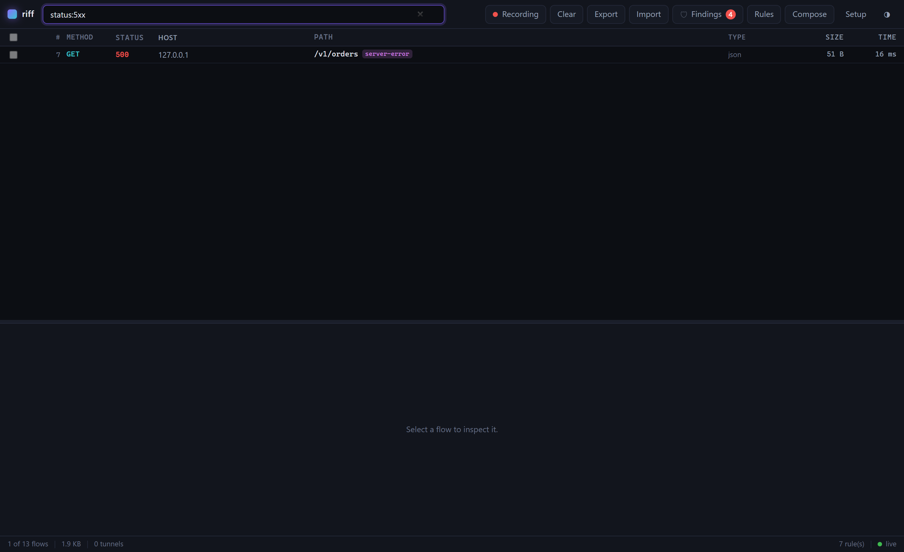

### Request detail

Headers, query, cookies and a pretty-printed body. Note `"password"` here —
a `redact` rule masked it *before* it ever reached the capture buffer.

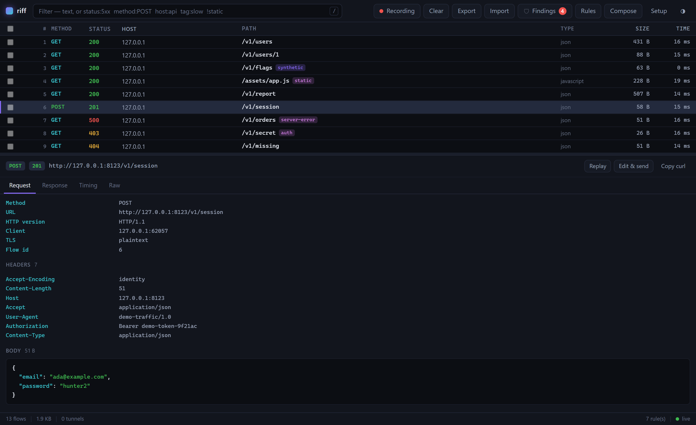

### Response detail

Status, headers, `Set-Cookie`, and the decoded body. gzip, deflate, brotli and
zstd are decoded for display automatically.

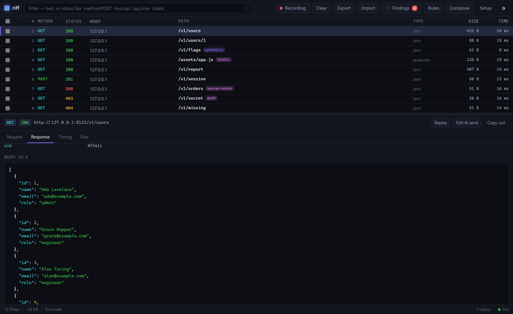

### Mocked responses

A `respond` rule answers the request itself. The flow is marked `synthetic` and
never reaches the origin — useful for feature flags, error paths, and endpoints
that do not exist yet.

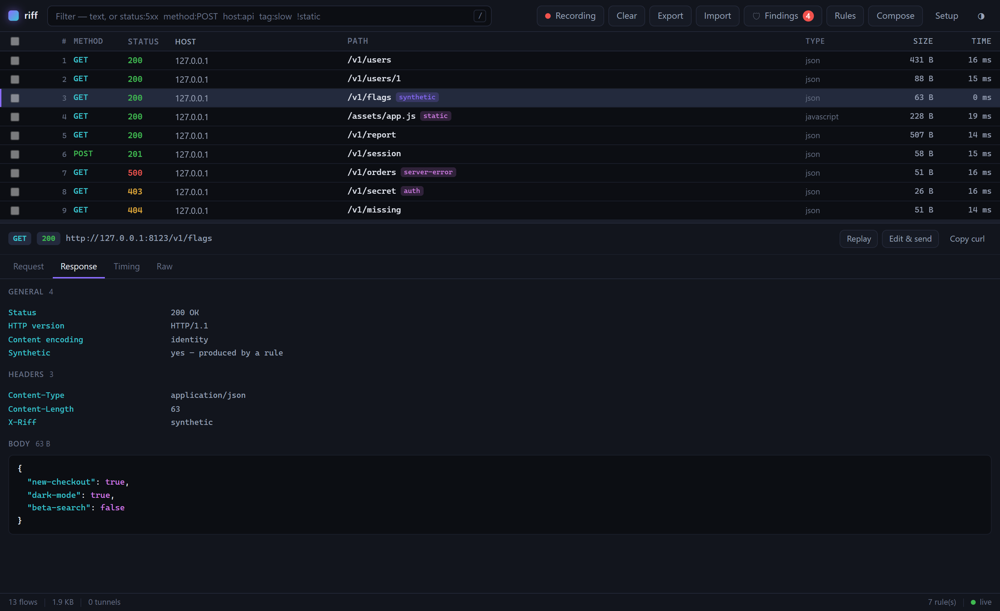

### Timing

Duration, payload sizes, plus anything your rules logged or tagged for this
flow.

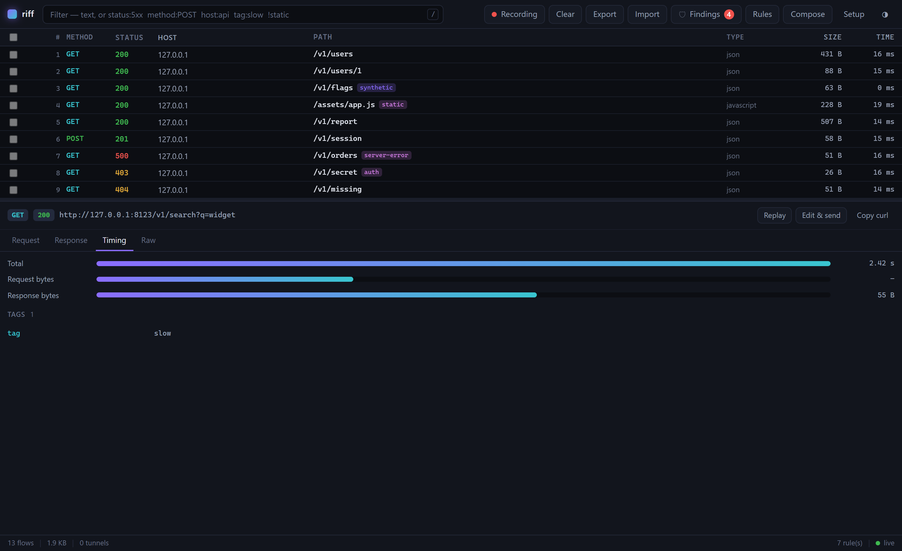

### Raw

The literal bytes, for when framing is what you are debugging.

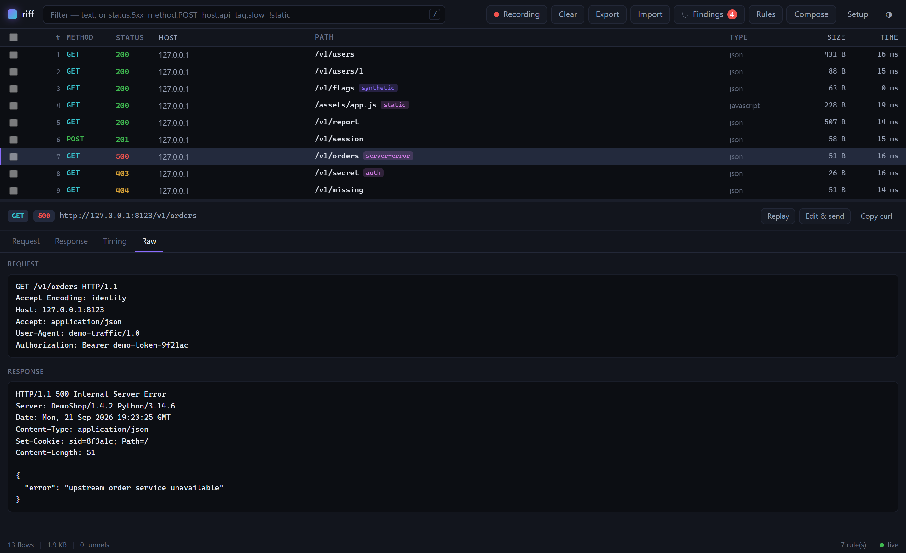

### Rules, edited live

Edit the script and hit **Save & apply**. The new rules take effect on the next
request — no restart, nothing dropped.

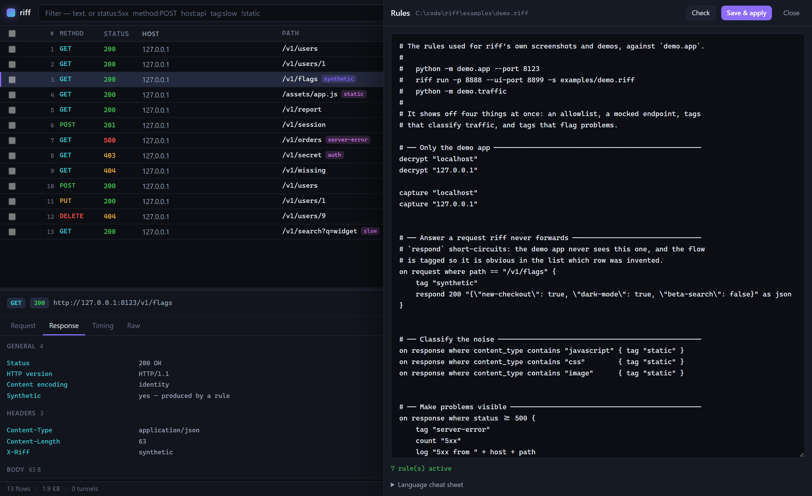

A script that does not parse is **rejected**, with the line, column and a caret
on the offending token. The running engine keeps the last good version.

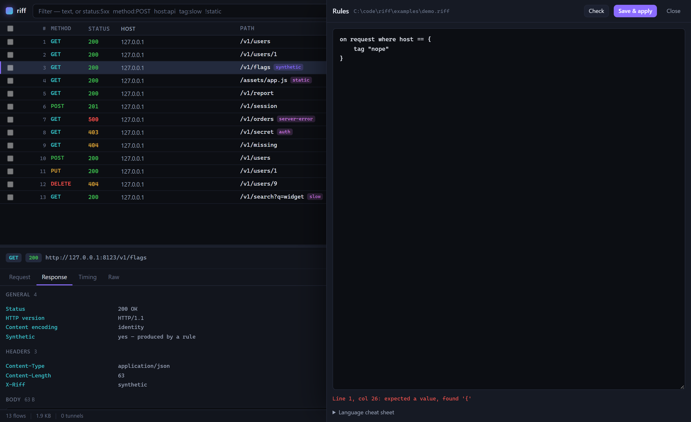

### Compose

Compose is a small API client inside riff. Build a request by hand, or hit
**Edit & send** on any captured flow to reopen it here with its real headers,
cookies and body. **Replay** re-sends a flow as-is; **Copy curl** puts it on
your clipboard.

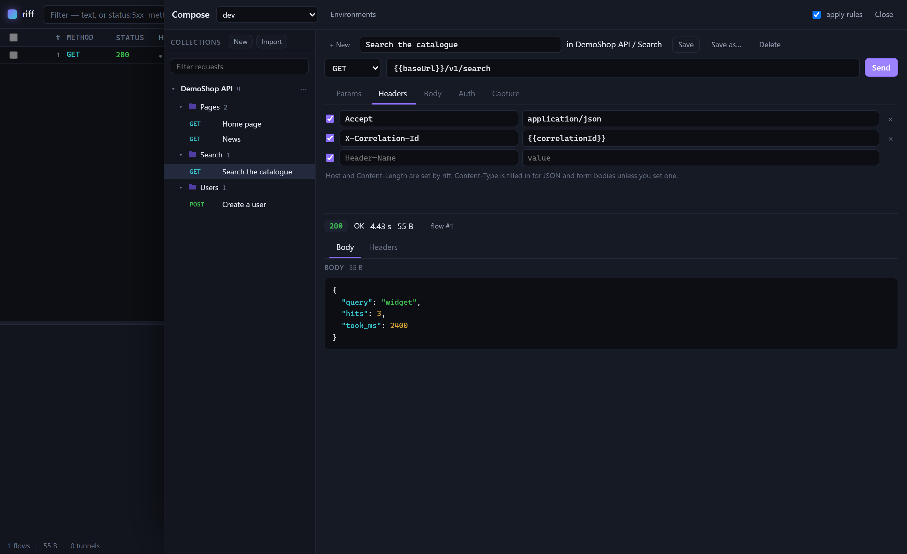

> 🎬 **Video.** [tutorial/riff-compose-tour.mp4](tutorial/riff-compose-tour.mp4) is
> a narrated tour for people new to API clients: building a request, reading the
> response, saving it into a collection and a folder, environments and
> `{{variables}}`, logging in once and capturing the token for every other
> request, and moving collections in and out. Every request in it is answered by
> a mock rule, so it plays the same offline.

What the drawer gives you:

- **Structured editors.** Params and headers are key/value grids with an
  enable box per row. The body is none, JSON, text or form; JSON is validated
  before it goes. Ctrl+Enter sends.
- **The response right there.** Status, time and size, the body pretty-printed,
  the headers, and a link to the flow in the traffic list. Every send is also a
  normal row, so you can filter, tag, export and diff it like anything else.
- **Collections.** Save a request into a named collection, reopen it from the
  rail on the left, rename or delete. Collections are plain JSON files in a
  `collections/` folder next to your rules file, so they go into a repo and the
  whole team gets them. **Import** takes a Collection v2.x file (the portable
  format most API clients read and write), a riff collection or a HAR file;
  **Export as Collection v2.1** goes the other way. Both keep the folder tree.
- **Folders.** Group requests inside a collection: `Get
  Token`, `User tests`, `Teardown`, nested as deep as you like. Pick a folder
  (or type a new one) when you save, or drag a request onto a folder or onto the
  collection name to move it. The `⋯` menu on a folder adds a request or a
  subfolder, renames (children follow) or deletes it. Folders fold and stay
  folded, and the **filter** box above the tree narrows a big collection to the
  requests whose name or URL match. In the JSON a request carries
  `"folder": "User tests/Garbage"` and the collection lists its `folders` in
  order, so hand-editing is easy.
- **Environments and variables.** Write `{{baseUrl}}`, `{{token}}` anywhere and
  pick an environment (dev, staging, prod…) in the drawer head. Shared values
  live in `environments/<name>.json` beside the collections. **Personal values**
  are kept in your riff home, never committed, and override shared ones — that
  is where tokens belong. Collection-level variables sit underneath both.
- **Auth helpers.** Bearer, basic and API key (header or query), on a request
  or inherited from the collection. Use variables so the secret stays personal.
- **Capture.** After a send, pull a value out of the response — a JSON path
  such as `data.access_token`, a header, or the status — into your personal
  values for the current environment. Log in once, then every request in the
  collection can use `{{token}}`.

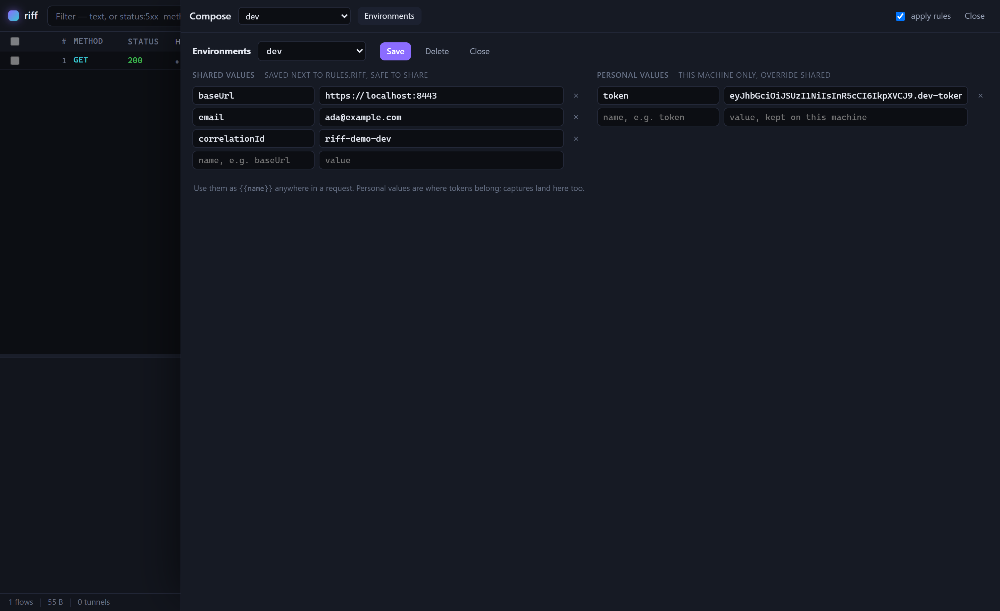

Rules apply to composed requests exactly as they do to captured traffic (untick
**apply rules** to bypass them), so a mock or a header rewrite in your rules file
affects saved requests too. Deep links: `#compose/<collection>/<request-id>`.

What it does not try to be: collection runners, test assertions, monitors,
generated docs or team workspaces. When a request grows into a repeatable test,
export the collection and run it in a dedicated tool.

### Security findings

**Findings** in the toolbar opens riff's passive security scanner. As traffic
goes past, riff reads what it already captured and raises a finding whenever a
response looks unsafe. It sends nothing of its own: these are checks over the
bytes you were already going to see, so there is no scanning traffic and no
target to authorise. It is on by default. Turn it off for a run with
`riff run --no-scan`.

What it flags today, each with a severity and the flow it came from:

- **Missing browser-hardening headers** on HTML responses — no
  Content-Security-Policy, `X-Content-Type-Options: nosniff`, X-Frame-Options,
  or (over HTTPS) Strict-Transport-Security.
- **Weak cookies** — `Set-Cookie` without `Secure` (on HTTPS), `HttpOnly`, or
  `SameSite`.
- **Credentials over plaintext HTTP** — an `Authorization`, `Cookie`, or API-key
  header on an `http://` request, readable by anyone on the path.
- **Permissive CORS** — `Access-Control-Allow-Origin: *` together with
  `Access-Control-Allow-Credentials: true`.
- **Version banners** — a `Server` or `X-Powered-By` header that leaks a version.
- **Secrets in a response body** — a private key or a cloud access-key id served
  to the client.

The panel lists findings worst-first. Each row's `#number` jumps to the flow so
you can see the request and response behind it. Repeats collapse: a site missing
a header shows once for that host, not once per request. **Rescan** re-runs the
checks over everything in the buffer — handy after you have already captured a
session, or after toggling scanning on. **Clear** empties the list; clearing the
traffic buffer clears the findings too.

The same thing from a script:

```
curl -H "X-Riff-Token: <token>" http://localhost:8899/api/findings
```

#### The active scan

The passive checks above never send anything. The **Active scan** in the same
drawer does: it injects attack payloads and judges the responses, so it finds
things the response bytes alone cannot show. By default it runs reflected XSS,
error- and boolean-based SQL injection, open redirect, path traversal, and
server-side request forgery on inputs that look like a URL.

Because it sends attack traffic, it is gated on scope. Type one or more in-scope
hosts (exact, or a glob like `*.internal.example.com`), then **Active scan**.
riff only probes hosts you named, and re-checks every probe's target against
your list before it goes out, so a scan cannot wander onto a third-party host
that happened to show up in the capture. Only scan what you are authorised to
test. Tick **time-based** to add the slower timing checks (blind SQLi and OS
command injection). Tick **out-of-band** to catch blind SSRF and blind injection
against a target on this machine.

Headless, over a saved capture, for CI or a one-off:

```
riff scan session.riff --host api.example.com --out report.md
```

It reads a riff export or a HAR file, scans only the in-scope flows, writes a
Markdown or JSON report grouped by category with fixes, and exits non-zero when
it finds anything high or medium. `--time-based` adds the timing checks;
`--oob` (or `--collaborator-host <addr>` for a remote target) enables out-of-band
detection; `--delay-ms` rate-limits the probes; `--checks` picks specific checks.

Findings are leads, not proof. High-confidence checks aside, confirm anything
marked *tentative* by hand.

### Export and import

Tick the rows you want — the checkbox at the left of each row, `ctrl`-click,
`shift`-click for a range, or the header checkbox for everything shown — and
hit **Export**. With nothing ticked it exports everything the filter shows.

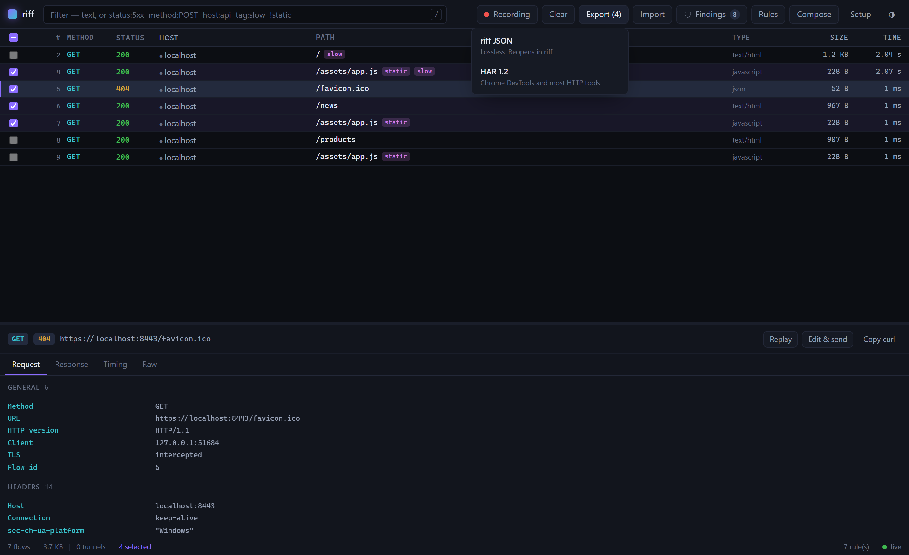

- **riff JSON** is lossless: every header, body, tag and timing comes back
  exactly when you **Import** it, on this machine or a colleague's.
- **HAR 1.2** opens in Chrome DevTools and most other HTTP tools.
  riff's own extras — tags, client, the TLS flag — ride in each entry's comment.

**Import** takes either format, several files at once. Imported rows get fresh
numbers and an `imported` tag, and behave like any other row: inspect, filter,
**Replay**, **Edit & send**. Filter with `tag:imported` or `!tag:imported`.

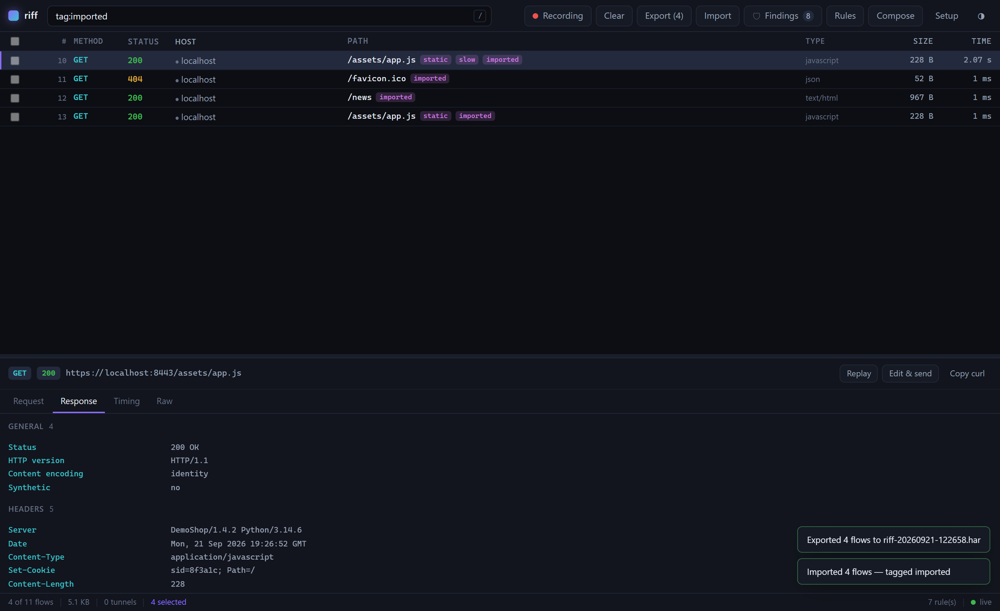

The same thing from a script:

```
curl -H "X-Riff-Token: <token>" "http://localhost:8899/api/export?ids=12,13,20&format=har" -o flows.har
curl -H "X-Riff-Token: <token>" -X POST --data-binary @flows.har http://localhost:8899/api/import
```

### Setup

Certificate path, SHA-256 fingerprint, expiry, download link, the exact
`certutil` commands to trust and untrust it, and your current decrypt policy.

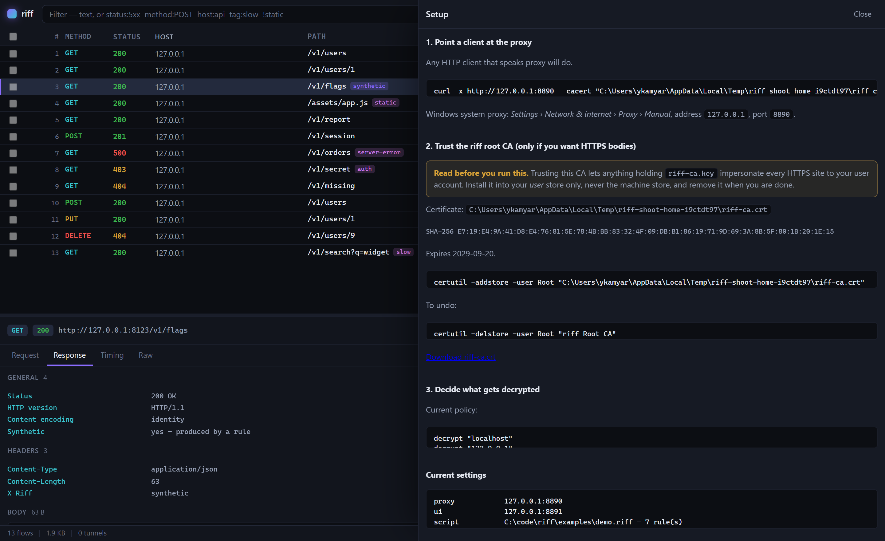

### Light theme

Follows your OS by default; the toggle in the top right overrides it.

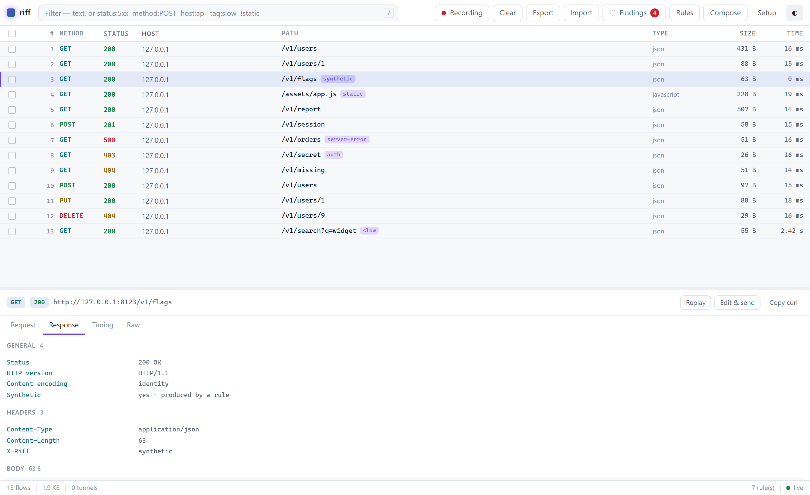

### Capturing a browser without touching system settings

On a machine running an endpoint agent that manages the proxy — Zscaler, Netskope
and friends — flipping the Windows proxy is a fight you don't need. Launch a
dedicated browser window wired straight to riff instead:

```
riff-browser.cmd https://your-api.example.com/
```

It opens Chrome (or Edge) with `--proxy-server` and an isolated profile. Only
that window is captured, your normal browsing is untouched, no system settings
change, and there is nothing to restore afterwards. For a throwaway window this
is the quickest route. To capture the Chrome you already use, install the
extension in the next section. `riff proxy on` remains available when you want
everything on the machine captured and no endpoint agent is in the way.

What Zscaler Client Connector actually does, measured on a managed laptop:
while it is **enabled** it watches the Windows proxy key and reverts any change
within a second — riff's or anything else's — so `riff proxy on` cannot hold
and the dedicated window above is the only way to capture a browser. Turning
Zscaler **off** clears the proxy once more and then leaves it alone, so
`riff proxy on` works until Zscaler is next enabled.

riff handles both cases. `riff proxy on` watches for two seconds after
applying the setting and tells you plainly if an agent reverted it. While
running, riff re-applies the setting if something clears it (the once-only
case) and shows a toast in the UI and a line in the console. If the setting is
reverted five times in a row it stops fighting, says so, and points you at
riff-browser.cmd; a fresh `riff proxy on` earns a fresh attempt. A deliberate
`riff proxy off` is always respected. Turn the watcher off with
`riff run --no-proxy-watch`.

Chrome and Edge pick up a system proxy change within a few seconds, but the
first page you load right after the change may still go direct. Reload it.

### Your everyday Chrome: the extension

The dedicated window above is a separate browser. If you want the Chrome you
already use — signed in, your tabs, your other extensions — captured, install
the small extension in [`extension/`](extension/). It sets Chrome's *own* proxy
setting through the `chrome.proxy` API. That setting lives inside the browser
profile, not in the Windows registry key Zscaler polices, so Zscaler cannot
revert it. Flip it off and Chrome goes back to its normal connection. About a
minute, no admin rights.

1. Start riff if it is not running: `riff run -s rules.riff`
2. Open `chrome://extensions` and switch on **Developer mode**, top right.

   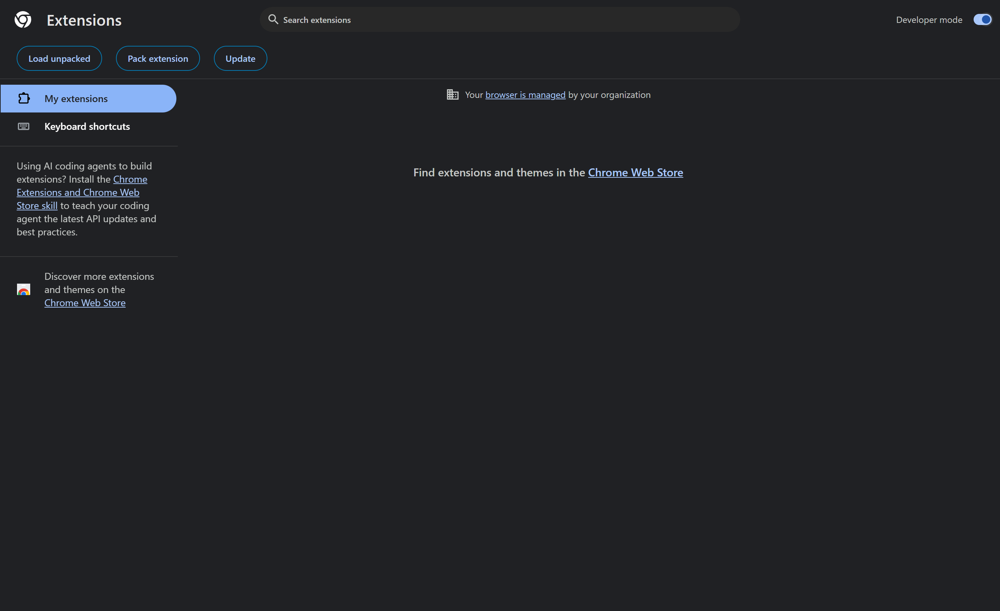

3. Click **Load unpacked** and pick the `extension` folder next to `riff.exe`
   — the `extension` folder next to `riff.exe`. The
   **riff proxy switch** card appears in the list.

   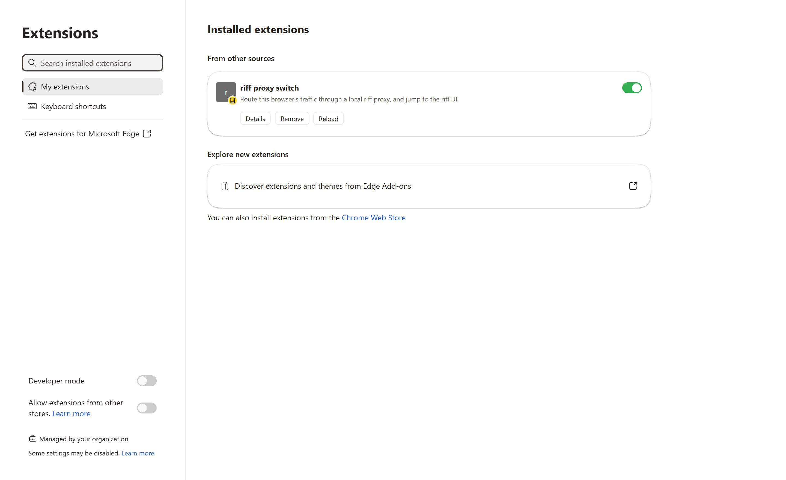

4. Click the riff icon in the toolbar — it may be under the puzzle-piece menu;
   pin it — and flip the switch. The icon shows an **on** badge.

   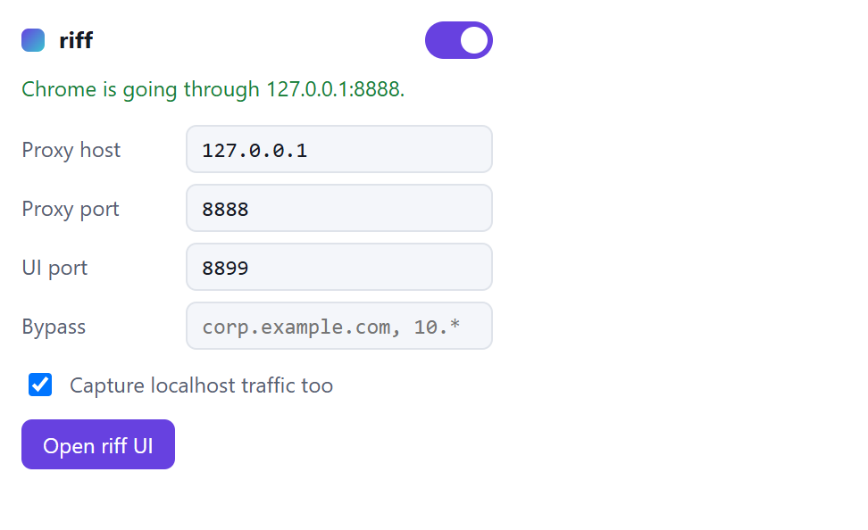

5. Reload the page you are working on. It appears in riff.

   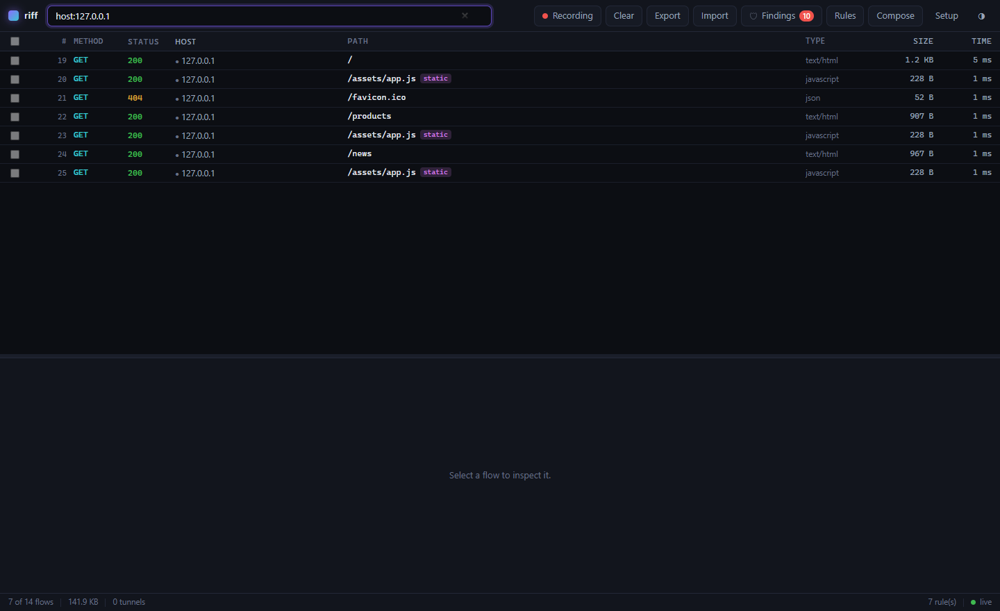

🎬 The same five steps as a one-minute recording:
[docs/riff-extension-install.webm](docs/riff-extension-install.webm)
(opens in Chrome or Edge).

Things to know:

- **It is per profile.** Everything in that Chrome goes through riff while the
  switch is on — Teams web, Outlook web, all of it. Hosts your rules do not
  `capture` still load normally; they just are not recorded.
- **Capture localhost traffic too** adds Chrome's `<-loopback>` bypass, so your
  local dev servers show up as well. Chrome never sends those through a system
  proxy, so this is the only way to see them from a normal window.
- **Open riff UI** opens whichever of `localhost` and `127.0.0.1` already holds
  the token cookie. If neither does yet, run `riff ui --open` once.
- Chrome shows a *Disable developer mode extensions* bar on start-up while an
  unpacked extension is loaded. Dismiss it, or pack the folder into a `.crx`
  (`chrome://extensions` → **Pack extension**) and have IT deploy that.
- If the popup says a policy or another extension controls the proxy, that
  wins and the switch will not take effect.
- Edge takes the same folder through `edge://extensions`; its Developer mode
  toggle is bottom-left. The card screenshot above was taken in Edge, because
  Google's Chrome no longer lets automation load an unpacked extension.

### Pointing an API client at riff

Nothing above is browser-specific. Any client told to use `127.0.0.1:8888` is
captured, and several clients can be captured at once — riff is one proxy
serving all of them, and they all appear in the same list.

| Client | How |
|---|---|
| curl | `-x http://127.0.0.1:8888` |
| .NET | `new WebProxy("http://127.0.0.1:8888")`, or the `HTTP_PROXY` / `HTTPS_PROXY` environment variables |
| Python | `HTTP_PROXY` / `HTTPS_PROXY` |
| Desktop API clients | Settings then Proxy then custom, `127.0.0.1:8888` |
| Java | `-Dhttp.proxyHost=127.0.0.1 -Dhttp.proxyPort=8888 -Dhttps.proxyHost=127.0.0.1 -Dhttps.proxyPort=8888` |
| Node | `HTTP_PROXY`, though some libraries need an explicit agent |

Configuring the client directly is more reliable than the system proxy, because
an endpoint agent cannot override it.

**Runtimes with their own trust store** need the CA separately. `riff ca install`
only populates the Windows store, which covers .NET, curl and browsers:

```
setx NODE_EXTRA_CA_CERTS "%USERPROFILE%\.riff\riff-ca.crt"
setx REQUESTS_CA_BUNDLE  "%USERPROFILE%\.riff\riff-ca.crt"
```

Java needs `keytool -importcert` into its `cacerts`. Without this you will see
certificate errors from those clients even though browsers work.

### Getting back to the UI

The address is printed once at startup and carries a token. If it scrolls away,
ask for it again from any other console:

```
riff ui           # prints the address
riff ui --open    # opens it in your browser
```

Or start with `riff run --open` and skip the copying entirely.

The token lives in a cookie scoped to the hostname you opened, so
`localhost:8899` and `127.0.0.1:8899` each need the token once. Both work —
open the tokenised URL on whichever you prefer and it sticks for that one.

### Keyboard

`/` filter · `j`/`k` move · `x` tick · `e` export · `i` import · `f` findings ·
`space` pause · `c` clear · `s` rules · `n` compose · `Esc` close

Deep links: `#rules`, `#compose`, `#setup`, `#flow/12`, `#flow/12/response`.

Run headless with `--no-ui`.

---

## The rule language

A `.riff` script is a list of TLS directives and `on request` / `on response`
rules. There is no `exec`, no imports, no network access, and no filesystem
access beyond an explicit `save` — it is a sandbox, not an embedded interpreter.

```riff
# Only decrypt what you own. With any `decrypt` present, everything
# else is tunnelled opaquely and stays unreadable.
decrypt  "*.internal.example.com"
passthru "login.microsoftonline.com"

on request where host ~ "api\." and method == "POST" {
    set header "X-Debug" = "1"
    redact header "authorization"
    log method + " " + url
}

# Mock an endpoint — this never reaches the network.
on request where path starts with "/v1/flags" {
    respond 200 "{\"enabled\": true}" as json
}

on response where status >= 500 {
    tag "server-error"
    count "5xx"
    save "C:/tmp/riff-errors"
}

on response where duration > 2000 { tag "slow" }
```

Check a script without running it:

```bash
riff check examples/starter.riff
```

### Scope: which hosts, and what gets listed

Two independent filters, both matched the same way — an exact host, a bare
domain (which also covers its subdomains), a `*` glob, or `re:` for a regex.
**First match wins**, so put narrow rules before broad ones.

```riff
# What gets decrypted. Naming any host makes it an allowlist, so
# everything else is tunnelled opaquely and never becomes readable.
decrypt  "*.internal.example.com"
passthru "login.microsoftonline.com"

# What gets listed. Naming any host makes this an allowlist too —
# but unlisted traffic still flows, it just isn't recorded.
ignore  "*.events.data.microsoft.com"
capture "*.internal.example.com"
```

`capture` and `decrypt` are independent: a host can be decrypted but not
recorded, or recorded (headers and timings) without being decrypted.

`riff check <script>` prints both scopes so you can see what a script will
actually do. See [examples/allowlist.riff](examples/allowlist.riff) for a full
host-allowlist setup.

### Values

| | |
|---|---|
| Request | `method` `url` `host` `port` `scheme` `path` `query["k"]` |
| Current message | `header["X"]` `cookie["c"]` `body` `size` `version` |
| Response | `status` `reason` `duration` `content_type` |
| Explicit side | `req.method` `req.body` `req.header["X"]`, `resp.status` … |
| Flow | `id` `client` `tls` `tags` `phase` |

In an `on response` rule, bare `header` / `body` mean the **response**; request
fields stay reachable as `host`, `path`, `req.header["X"]` and so on.

### Operators

`== != < <= > >=` · `~` `!~` (regex) · `contains` · `in` · `starts with` ·
`ends with` · `and` `or` `not` · `+ - * / %`

Numbers take units: `500ms`, `2s`, `64kb`, `1mb`.

### Actions

| Action | Effect |
|---|---|
| `set`/`add`/`remove header\|query\|cookie "n" = v` | edit the current message |
| `set body\|status\|method\|path\|url\|host = v` | rewrite a field |
| `rewrite url "…"` | retarget upstream (absolute or path-only) |
| `respond <status> "body" as json` | answer without touching the network |
| `redact header\|cookie\|query\|body "name"` | mask a value in place |
| `abort` / `stop` | drop the connection / stop evaluating rules |
| `delay 500ms` | slow a flow down |
| `log` / `tag` / `count` / `save "<dir>"` | observe |
| `if … { } else { }`, `let x = …` | control flow |

### Builtins

`lower` `upper` `trim` `len` `int` `float` `str` `json` `dumps` `replace`
`split` `join` `uuid` `now` `env` `b64encode` `b64decode` `sha256`
`regex_group` `glob`

---

## Sharing it with other people

### Distribute a single binary

Build one file and hand it out — no Python, no `pip install`:

```powershell
.\packaging\build-exe.ps1
```

That writes `dist/riff.exe` (about 27 MB). Attach it to a GitHub release, drop
it on a file share, or copy it straight onto another machine.
`packaging/install-local.cmd` copies it into `%LOCALAPPDATA%\riff`, keeps any
`rules.riff` already edited there, and offers to run `riff setup`. No admin
rights, nothing installed system-wide.

**Each user gets their own certificate authority** under `%USERPROFILE%\.riff`,
generated on first run.

> **Never share a `RIFF_HOME`.** That would make everyone share one CA private
> key, and anyone who could read it could then impersonate any HTTPS site to
> everyone who trusts it.

### But they still have to change two things on their PC

Running riff needs no install. *Using* it does need two per-machine changes, and
this is inherent to intercepting TLS — every interception proxy needs the same
two:

| | Needed for | How |
|---|---|---|
| Trust a CA | reading **HTTPS** bodies | `riff.exe setup`, or `riff ca install` |
| Route traffic | anything at all | `riff proxy on`, the Chrome extension, or `curl -x` |

`riff setup` does both in one prompt-driven command, and both are reversible
(`riff ca uninstall`, `riff proxy off`). If you only need **plain HTTP**, skip
the certificate entirely — just point the client at the proxy.

### One shared instance instead

You can host riff on your machine and have colleagues point their proxy at it:

```bash
riff run --host 0.0.0.0 --auth team:somepassword --allow-from 10.4.0.0/16
```

Without `--auth` and `--allow-from` this is an open relay into your network, and
riff will warn you loudly. Colleagues import **`riff-ca.crt`** — the public
certificate, which is safe to hand out. The private key never leaves your
machine.

Be aware of what this means: their decrypted traffic, including their tokens
and cookies, is readable on your machine. That is a governance question more
than a technical one.

### Chrome extension

`extension/` holds a small MV3 extension whose only job is flipping Chrome's
proxy to riff and opening the UI. Install steps with screenshots are under
[Your everyday Chrome: the extension](#your-everyday-chrome-the-extension); the
design notes — why it avoids `chrome.debugger` and its permanent "being
debugged" banner — are in [extension/README.md](extension/README.md).

---

## Security

riff decrypts other people's traffic by design, so the security posture
matters. The short version:

1. **The CA private key is the crown jewel.** Anyone who can read
   `%USERPROFILE%\.riff\riff-ca.key` can impersonate every HTTPS site to your
   account. riff generates a **per-machine** CA (never a shipped key), ACLs it
   to you alone, and marks it `pathlen:0` so it cannot sign sub-CAs.
   **Constrain it and that first sentence stops being true** — see below.
2. **Trust-store changes are never automatic** and go to the **CurrentUser**
   store only, never LocalMachine. `riff ca uninstall` reverses it.
3. **Do not bind the proxy publicly** without `--auth` and `--allow-from`.
4. **Captured flows contain secrets.** `--jsonl` and `save` write plaintext.
   Use `redact`; the shipped example does.
5. **You become the only TLS check.** Upstream verification stays on;
   `--insecure` removes the last one.
6. **Decrypt narrowly**, so banking, SSO and health traffic stay opaque.

The **UI** is loopback-only with a random per-run token, an `HttpOnly` +
`SameSite=Strict` cookie, a double-submit header on every mutating call, a
strict CSP with no inline script, and Host-header validation to block DNS
rebinding. All of it is covered by tests.

### Constrain the CA

The usual objection to any interception proxy is that trusting its CA means
trusting it for *everything* — your bank included. riff can close that off.

```bash
riff ca regenerate --constrain-to "*.internal.example.com,localhost"
```

This bakes an RFC 5280 **`NameConstraints`** extension into the root, marked
critical. The CA is then *cryptographically incapable* of signing for anything
outside those subtrees. It is not a riff setting that could be flipped or
bypassed — it is in the signed certificate, and it is enforced by whatever
validates the chain: Windows, Chrome, Firefox, OpenSSL.

```
$ riff ca show
constrained  internal.example.com, localhost, 127.0.0.1/32
             this CA cannot sign for any other host
```

Ask for an out-of-scope host and riff tells you plainly instead of handing your
client a certificate it will silently reject:

```
riff: this CA is name-constrained and cannot sign for chase.com.
      It is limited to: internal.example.com, localhost, 127.0.0.1/32
```

Worth knowing what this buys you: even if the private key is stolen outright,
the thief gets a CA that can only impersonate hosts you already nominated. That
is a materially smaller blast radius than any unconstrained interception CA —
including the ones shipped by commercial proxies, none of which constrain by
default.

Constraints are applied when a root is **generated**, so widening or narrowing
them means regenerating and re-trusting. Existing CAs are unconstrained; run the
command above to convert.

---

## Command line

```
riff setup                        one-time per-user bootstrap
riff run    [-p PORT] [--host ADDR] [-s SCRIPT] [--no-ui] [--ui-port PORT]
            [--open] [--dump] [--quiet] [--no-scan] [--jsonl FILE]
            [--max-body 8mb] [--auth user:pass] [--allow-from CIDR]
            [--upstream-proxy URL] [--ca-cert PEM --ca-key PEM]
            [--insecure] [--ca-home DIR]
riff check  SCRIPT
riff scan   SOURCE --host HOST [--checks LIST] [--time-based] [--oob]
            [--collaborator-host ADDR] [--out FILE] [--delay-ms N]
            [--max-points N] [--workers N] [--insecure]
riff ca     path | show | install | uninstall | regenerate
riff ui     [--open]              print the running instance's UI address
riff proxy  on | off | status
```

---

## What it supports

HTTP/1.0 and HTTP/1.1, CONNECT tunnelling with selective MITM, keep-alive on
both sides, chunked and length-framed bodies, `Expect: 100-continue`,
gzip/deflate/brotli/zstd decoding, WebSocket upgrades (relayed opaquely after
the handshake), proxy authentication, and upstream proxy chaining.

**Not supported:** HTTP/2 and HTTP/3. riff advertises only `http/1.1` over
ALPN, so clients negotiate down. Bodies larger than `--max-body` stream through
without being buffered — rules see their headers but not their content.

---

## Development

```bash
pip install -e ".[dev]"
pytest
```

254 tests: the language, HTTP framing edge cases, real-socket end-to-end
proxying (including TLS interception against a live origin), access control,
the scanner, and the UI's security guards.

Regenerate the screenshots in this README — self-contained, it starts the demo
app and its own riff:

```bash
python packaging/shoot-docs.py
python packaging/shoot-compose.py
python packaging/shoot-export.py
```

### Layout

| Path | |
|---|---|
| `riff/script/` | lexer → parser → tree-walking interpreter |
| `riff/proxy.py` | connection handling, CONNECT, MITM, upstream |
| `riff/http.py` | HTTP/1.x framing and content codecs |
| `riff/ca.py` | root CA and on-the-fly leaf minting |
| `riff/access.py` | proxy credentials and address allowlists |
| `riff/webui.py` | hardened local API + static host |
| `riff/ui/` | the single-page UI |
| `riff/winproxy.py` | per-user Windows proxy toggle |
| `extension/` | Chrome proxy switch |
| `riff/scan/` | passive and active vulnerability scanning |
| `demo/` | a loopback demo app and traffic generator to try riff against |
| `packaging/` | standalone exe build, screenshot capture |
| `docs/` | screenshots |
